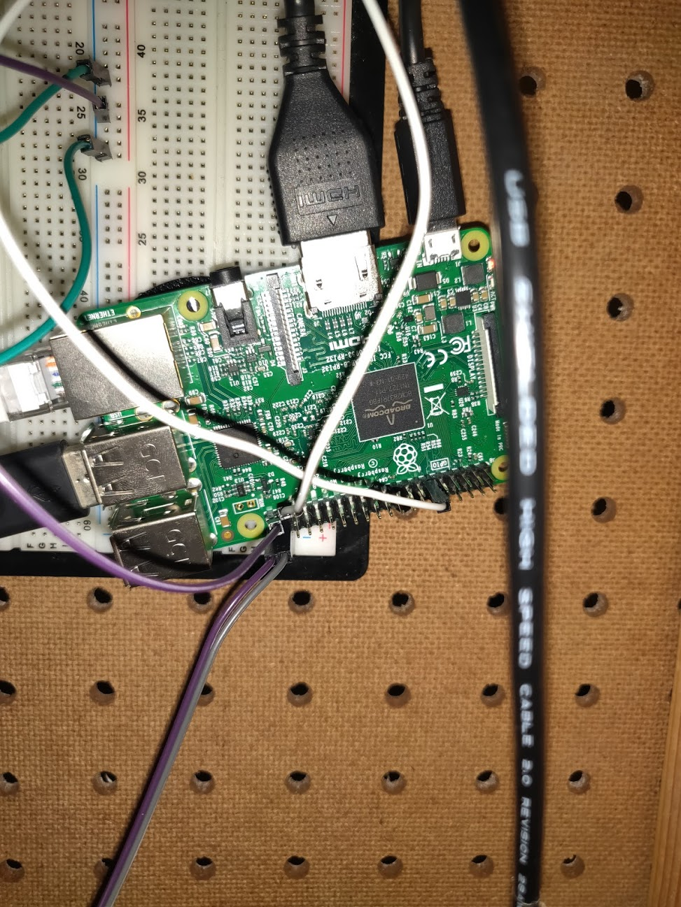
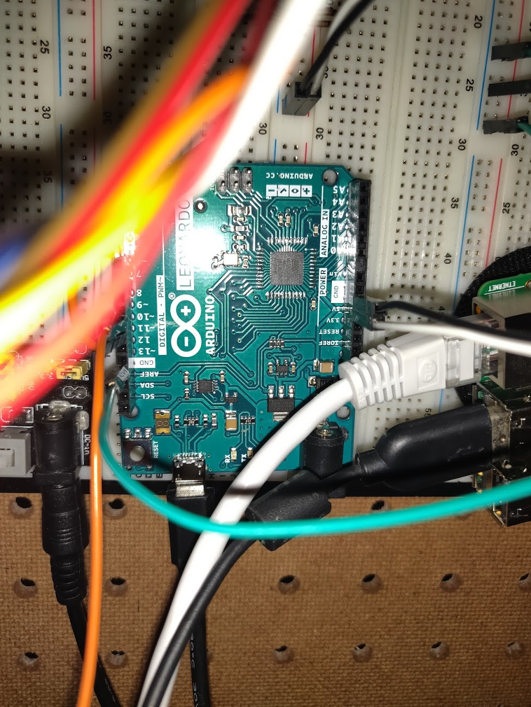

# CS179J Project Group 13
Team members: Chris Nguyen, Brittney Mun, Alex Wilkins, Haide He, Antonius Panggabean

## Sorting Recycling Machine
 This project consists of a machine that uses computer vision with machine learning to identify recycling objects like bottles and cans and sort them. The objects are placed on a platform that the camera will scan and make a decision on the type of object to place in different bins. After the classification is made, an arm will push the object off the platform and down the ramp. On the ramp, there are 2 arms that will move in accordance to the type of object that was identified. The arms will allow the object to fall into its intended container. 
 
 ## Construction
 [Full ramp construction](projPhotos/fullRamp.jpg)
 Built out of cut pegboard and 2x4'' wood, the ramp is set at a 30 degree angle. Initial designs involved a flat staging platform, but the redesign was considered as it was more suitable for the application. Having the force of gravity do most of the movement meant less debugging than a mechanism to move the objects off a flat platform.
 
 ## Operation
 
 
 The system is implemented on a Raspberry Pi communicating digital signals with an Arduino. The Raspberry Pi uses OpenCV and python to classify the picture that the on-board camera takes. The digital signal indicates what material the object in question is. The Arduino then takes this signal and drives the servos to release and redirect the object to the correct bin.
 
 ## For instructions on how it operates and demo on it functioning, [click here](https://www.youtube.com/watch?v=51ebx_BCK4s&)
